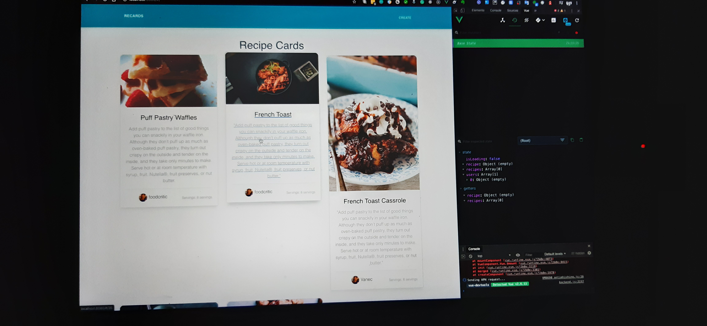

## Hello, My name is  Vantol Bennett - [MPS][website] / [Titan][website] 👋

> # Bio
> Secondary Teacher for the last 10 years, teaching Biology and Mathematics. I hold an Executive Masters in Educational Management along with a BSc. in Biochemistry and Botany.
  I have over eight (8) years experience in web and mobile application development. I am trying to become a content creator (hopefully). 
>

### I'm a Father, Developer, and Teacher!

- 🔭 I’m currently working on a [Next.js][website]!
- 🌱 I’m currently learning **Next.js**
- 🥅 2020 Goals: Contribute more to Open Source projects
- ⚡ Fun fact: I love to play video games

### Link with me:

[][website]
[][youtube]

 

### Languages and Tools:

 
 

---

### 📺 Latest YouTube Videos

<!-- YOUTUBE:START -->
# COMING SOON
<!-- YOUTUBE:END -->

➡️ [more videos...]()

---

### 📕 Latest Blog Posts

<!-- BLOG-POST-LIST:START -->
**Episode 0**

- Releasing Soon

**COMING SOON: Working Ep1**

<!-- BLOG-POST-LIST:END -->

➡️ [more blog posts...]

---

  
 Recent Github Activity

  

[website]: https://teammps.com
[youtube]: https://www.youtube.com/
